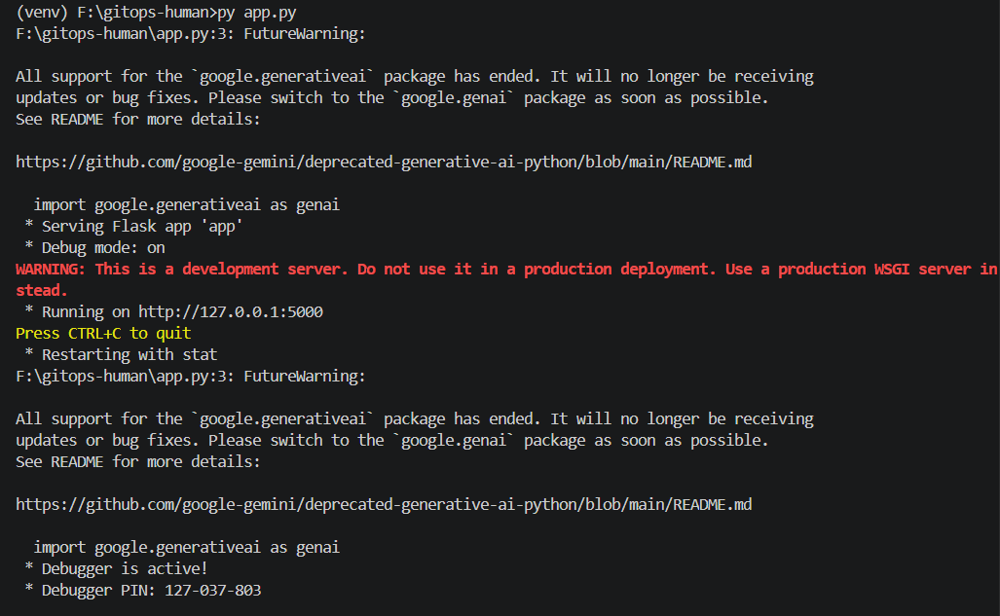
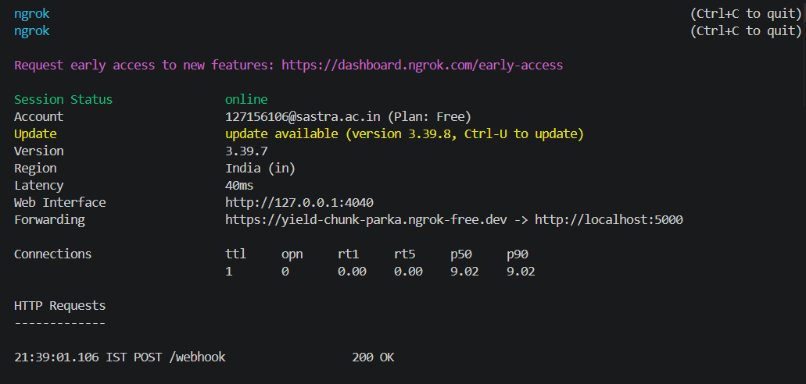
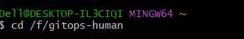
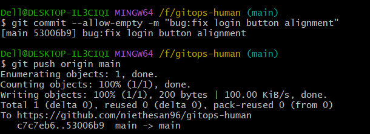
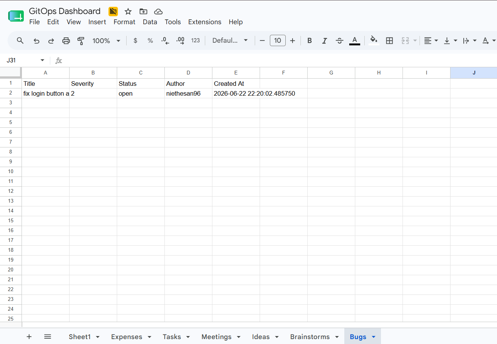
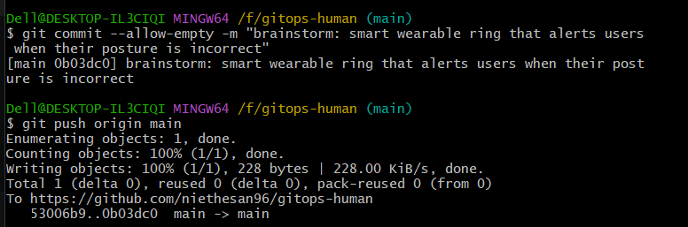
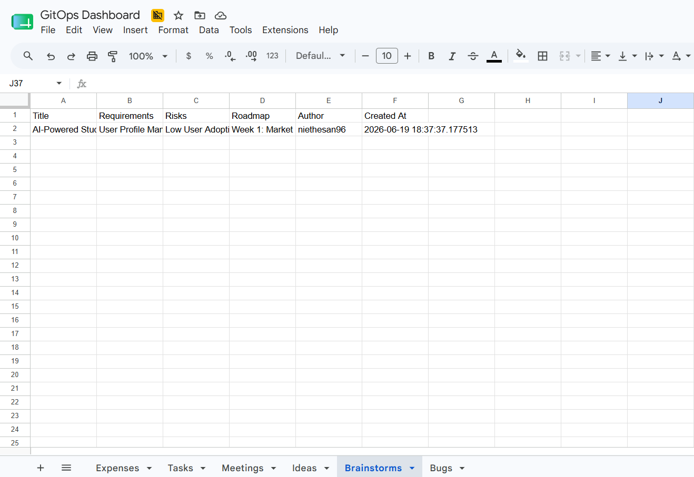

# GitOps for Humans 

A system where developers don't need to log into messy web dashboards. They live in the terminal, so we turned **Git commit messages into the universal control interface** for logging productivity metrics, task assignments, and live AI brainstorm mapping.

---

## How It Works (The End-to-End Pipeline)

1. **The Human Action**: A developer runs a standard `git push` with a categorized commit message prefix (e.g., `task:`, `meeting:`, `bug:`, `expense:`, `idea:`, `brainstorm:`).
2. **The Secure Proxy**: GitHub catches the push and fires an instant webhook alert. Since the application runs on a local computer, **ngrok** acts as a secure bridge tunnel to feed that cloud payload down to our local machine.
3. **The AI Compiler**: A local Python listener catches the data and passes the raw English string to **Google Gemini**. The AI translates the human sentence into a clean, machine-readable JSON structure.
4. **The Native Memory**: The backend engine immediately stores a permanent copy inside our local database. A native database trigger watches incoming traffic and sorts data fields instantly.
5. **The Live Desktop**: Simultaneously, the script speaks directly with Google Cloud APIs to update a **Google Sheets Dashboard** in real time, auto-creating workspace categorizations on-the-fly.

---

## How to Run the Project (Step-by-Step Execution)

To bring the live ecosystem online, we open **three parallel workspace terminal windows**:

### Window 1: Start the Python Backend Engine
Launch the local application framework to process incoming webhooks and coordinate API communication:


### Window 2: Establish the Secure Network Tunnel
Spin up the bridge client mapping your local port outward to your registered public testing domain:
```powershell
cd F:\gitops-human
.\ngrok.exe http 5000 --domain=yield-chunk-parka.ngrok-free.dev
```


### Window 3: The Command Center Terminal
Move into the project folder using your Git terminal to fire system trigger alerts


---

## 🎤 Core Demo Commands (Watch It Work Live!)

Once all windows are running, paste these commands into your **Git Terminal (Window 3)** to watch data populate the spreadsheet instantly:

```bash
# 1. Log a live system bug tracking event
git commit --allow-empty -m "bug: checkout payment page button crashes on mobile devices with severity 4"
git push origin main
```



```bash
# 2. Trigger the AI Agent to design a full 3-Week startup product roadmap
git commit --allow-empty -m "brainstorm: smart wearable ring that alerts users when their posture is incorrect"
git push origin main
```


